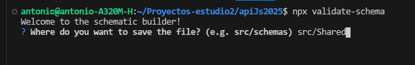
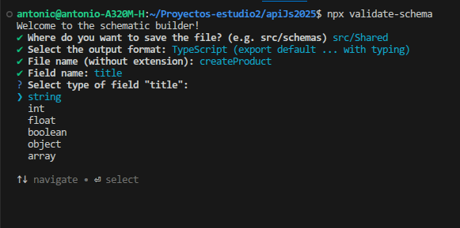

# CLI

::: info Command Line Interface
Interfaz de línea de comandos.
:::

La librería incluye una herramienta de línea de comandos que permite crear schemas de forma interactiva, reduciendo errores de sintaxis y acelerando el desarrollo.

Puede ejecutarla directamente:

```bash
npx generate-schema
```

o crear un script: 

```json
 "scripts":{
 "schemas" : "node generate-schema",
 "start": "..."
 }

```

En la consola se verá algo asi:



Al ejecutar el comando, la consola guiará paso a paso en la creación del schema, solicitando:

- Ubicación del archivo.
- Formato de salida.
- Nombre del schema.
- Campos y atributos a validar.




---

## Ejemplo en TypeScript

```ts
import { type Schema } from "req-valid-express";

const userCreate: Schema = {
    email: { type: "string" },
    password: { type: "string" },
    age: { type: "int", default: 18 }
};

```
En la proxima vista se tratarán con mas detalle los metodos