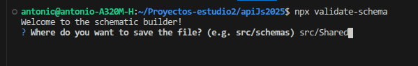
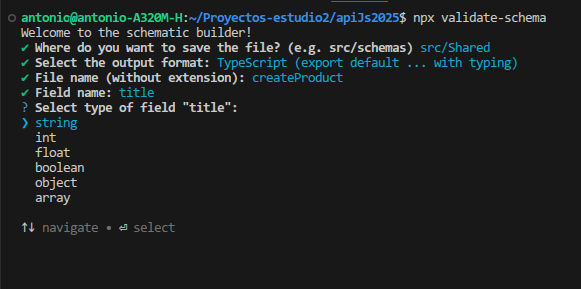

# CLI

::: info Command Line Interface

:::

The library includes a command-line tool that allows you to create schemas interactively, reducing syntax errors and accelerating development.

You can run it directly:

```bash
npx validate-schema
```

or create a script:

```json
"scripts":{
"gen:schema": "validate-schema",
"start": "..."

}

```

The console will display something like this:



When you run the command, the console will guide you step-by-step through the schema creation process, prompting you for:

- File location.

- Output format.

- Schema name.

- Fields and attributes to validate.



---

## Example in TypeScript

```ts
import { type Schema } from "req-valid-express";

const userCreate: Schema = {
email: { type: "string" },
password: { type: "string" },
age: { type: "int", default: 18 }
};

```

The methods will be covered in more detail in the following sections.
